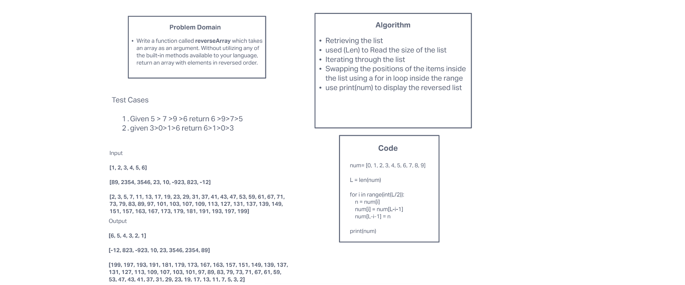

# Reverse an Array
Write a function called reverseArray which takes an array as an argument. Without utilizing any of the built-in methods available to your language, return an array with elements in reversed order.

## Whiteboard Process

## Approach & Efficiency
The reason we set the array to a variable is so that we can call it down the line, then assigning the length of the array to a variable to make it quicker to access in our loop. Using a for/in loop to itterate through the array allows us to count each individual index, and the range bit lets us only go to half. The loop is then built to swap the index on either end of the point until we reach the center of the array. Then finally we print the end product.

-Teammate Ibraheem Ibraheem