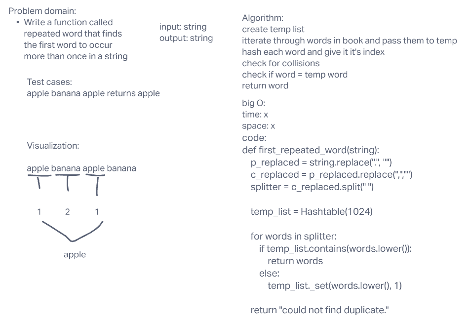

# Hashtables

An implementation of set, get, contains, keys, and hash methods to successfully create and hash.

## Challenge

Create an implementation of hashtable commands.

## Approach & Efficiency

time: depends on which method you use.
space: depends on which method you use.

## API

1. set: This method should hash the key, and set the key and value pair in the table, handling collisions as needed. Should a given key already exist, replace its value from the value argument given to this method.
2. get: Returns: Value associated with that key in the table
3. contains: Returns: Boolean, indicating if the key exists in the table already.
4. keys: Returns: Collection of keys
5. hash: Returns: Index in the collection for that key

## Hashtable repeated word

A function that allows you to find the first repeated word in a string.

## Challenge 2

create a function that finds the first repeated word in a string.

## Whiteboard c2

## Challenge 3

Using your Hashmap implementation as a part of your algorithm, return a set of values found in both trees.

## Whiteboard c3

