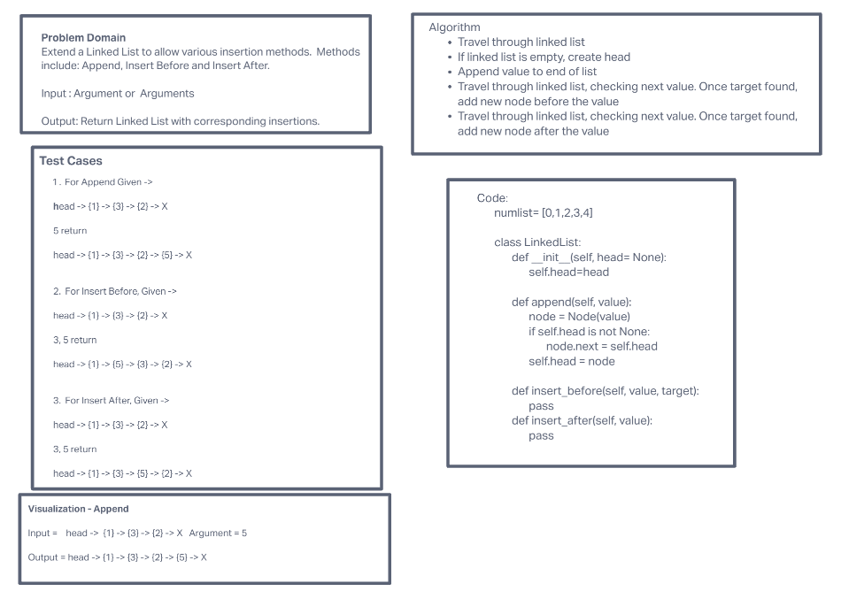

# linked-list-insertions challenge

Write methods for a linked list class which takes a linked list and allows various insertion methods.

## Whiteboard

## Approach and efficiency

first created the linked list, then created the method to traverse through the list. Then created a method for each, adding a node at the end, before a target and after a target.

