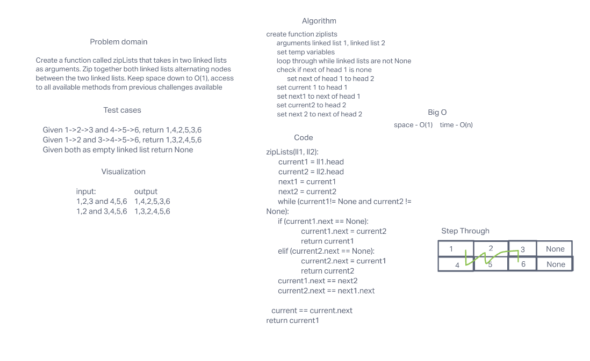

# linked-list-zip challenge

take two linked lists and merge them together by doing them in order of eachother.

## Whiteboard

## Approach and efficiency

simply creating the function, traversing through each list one at a time in correspondance with the other lists current location. Whiteboard code did not work so my code is a bit different.
