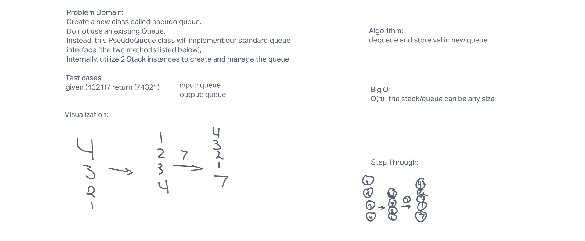
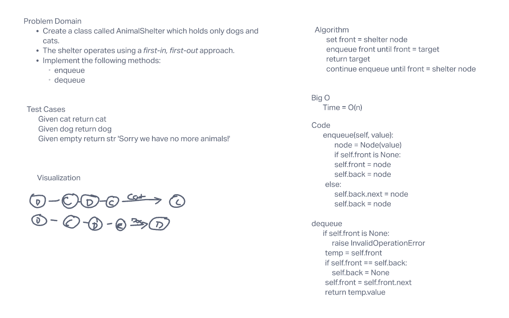
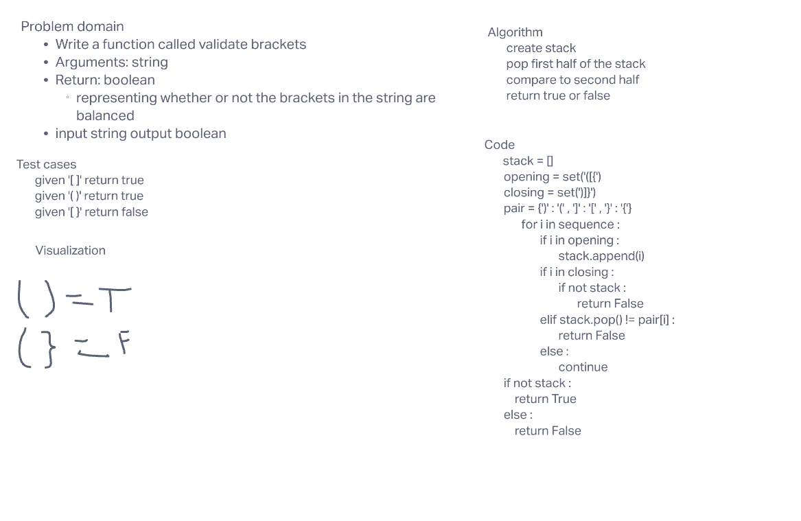

# Stacks and Queues

Using a Linked List as the underlying data storage mechanism, implement both a Stack and a Queue.

## Challenge

create a stack, queue and implement all the necessary functions to handle the classes.

## Approach and Efficiency

Worked with JJ.

## stack queue pseudo

Create a new class called pseudo queue.
Do not use an existing Queue.
Instead, this PseudoQueue class will implement our standard queue interface (the two methods listed below),
Internally, utilize 2 Stack instances to create and manage the queue

## Whiteboard

## stack and queue animal shelter

Create a class called AnimalShelter which holds only dogs and cats.
The shelter operates using a first-in, first-out approach.
Implement the following methods:
enqueue
Arguments: animal
animal can be either a dog or a cat object.
dequeue
Arguments: pref
pref can be either "dog" or "cat"
Return: either a dog or a cat, based on preference.
If pref is not "dog" or "cat" then return null.

## Whiteboard 2

## bracket verification

Write a function called validate brackets
Arguments: string
Return: boolean
representing whether or not the brackets in the string are balanced

## Approach

worked in group whiteboard may be different than actual code. Aoife in particular helped me with my challenge.

## White board 3

