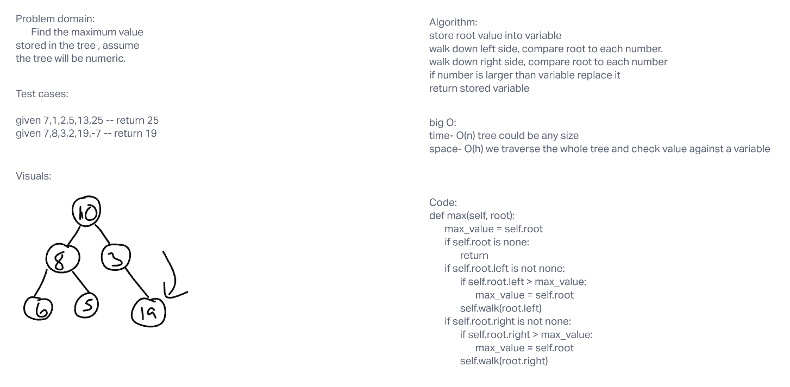

# Trees

Initialize binary tree and search.

## Challenge

Binary Tree
Create a Binary Tree class
Define a method for each of the depth first traversals:
pre order
in order
post order which returns an array of the values, ordered appropriately.
Binary Search Tree
Create a Binary Search Tree class
This class should be a sub-class (or your languages equivalent) of the Binary Tree Class, with the following additional methods:
Add
Arguments: value
Return: nothing
Adds a new node with that value in the correct location in the binary search tree.
Contains
Argument: value
Returns: boolean indicating whether or not the value is in the tree at least once

## challenge 2

Write the following method for the Binary Tree class

find maximum value
Arguments: none
Returns: number
Find the maximum value stored in the tree. You can assume that the values stored in the Binary Tree will be numeric.

## max value white board

[ ] Top-level README “Table of Contents” is updated
[ ] README for this challenge is complete
[ ] Summary, Description, Approach & Efficiency, Solution
[ ] Picture of whiteboard
[ ] Link to code
[ ] Feature tasks for this challenge are completed
[ ] Unit tests written and passing
[ ] “Happy Path” - Expected outcome
[ ] Expected failure
[ ] Edge Case (if applicable/obvious)
